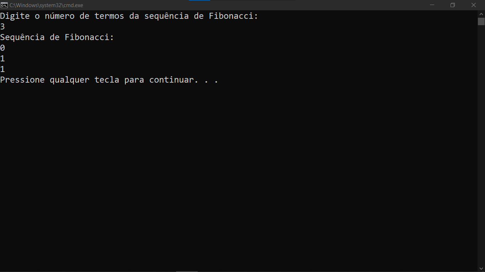

# SEQUENCIA DE FIBONACCI
👨‍🏫CALCULO DE SEQUENCIA DE FIBONACCI NO CONSOLE DO VISUAL STUDIO.

  

## DESCRIÇÃO:
Este projeto é um aplicativo de console simples que calcula e imprime a sequência de Fibonacci até um número especificado de termos fornecido pelo usuário. A sequência de Fibonacci é uma série de números onde cada número é a soma dos dois anteriores, começando com 0 e 1.

## FUNCIONALIDADES:
1. **Solicita ao usuário o número de termos da sequência de Fibonacci.**
2. **Calcula os termos da sequência de Fibonacci usando uma função recursiva.**
3. **Imprime os termos da sequência de Fibonacci no console.**

## EXECUTANDO O PROJETO:
### ABRINDO NO VISUAL STUDIO:
- Abra o projeto `./CODIGO` no Visual Studio:
  1. Abra o Visual Studio.
  2. Clique em `File` > `Open` > `Project/Solution`.
  3. Navegue até o diretório `./CODIGO`.
  4. Selecione o arquivo da solução (`.sln`) do projeto e clique em `Open`.
  5. No Solution Explorer, abra o arquivo `Program.cs` para ver o código-fonte.

#### COMPILANDO E EXECUTANDO O PROJETO:
1. Pressione `Ctrl + Shift + B` para compilar o projeto.
2. Após a compilação, pressione `Ctrl + F5` para executar o projeto sem depuração.

### ABRINDO O EXECUTÁVEL:
- Abra o executável em `./CODIGO/Fibonacci2/bin/Debug/Fibonacci2.exe`:
  1. Abra o Explorador de Arquivos.
  2. Navegue até o diretório `./CODIGO/Fibonacci2/bin/Debug/`.
  3. Dê um duplo clique no arquivo `Fibonacci2.exe` para executar o aplicativo.

### INTERAGINDO COM APP:
1. Digite um número inteiro positivo e pressione Enter.
2. O programa calculará e imprimirá os termos da sequência de Fibonacci no console.

## NÃO SABE?
- Entendemos que para manipular arquivos nas linguagens relacionadas, é necessário possuir conhecimento nessas áreas. Para auxiliar nesse aprendizado, oferecemos cursos gratuitos disponíveis:
* [CURSO DE VISUAL STUDIO](https://github.com/VILHALVA/CURSO-DE-VISUAL-STUDIO)
* [CURSO DE C#](https://github.com/VILHALVA/CURSO-DE-C-SHARP)
* [CONFIRA MAIS CURSOS](https://github.com/VILHALVA?tab=repositories&q=+topic:CURSO)

## CREDITOS:
- [PROJETO CRIADO PELO VILHALVA](https://github.com/VILHALVA)

